# Building a site with WordPress

Now that you've installed WordPress and logged in, we can get started building your site!

After logging in to WordPress, you will be greeted with your site's Dashboard. We'll be checking out the several parts of the Dashboard, but the first thing to pay attention to is the Home icon  at the top left. Clicking on this will exit the Dashboard and bring you to the public home page of your site. To return to the Dashboard, click the Speedometer icon .

### Posts

Posts in WordPress are the core of what make up a blog, they of course can let you write and put other content on a webpage, but they also display metadata about themselves, like when they were written, who the author was, and what category they belong to. We'll get started building our website by making our first post.

From the Dashboard, click on **Posts** to get started.

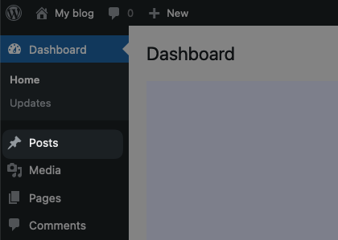

You'll notice that there is a sample post already here. You can get rid of this by hovering the title of the post and clicking **Trash**. 

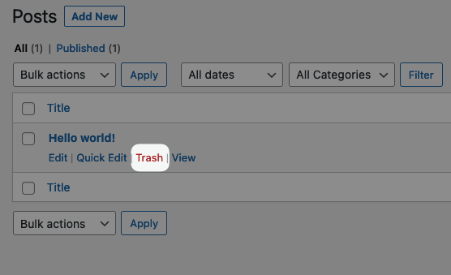

Click **Add New** to make your first post! Start by giving your post a title and putting some text on the page.

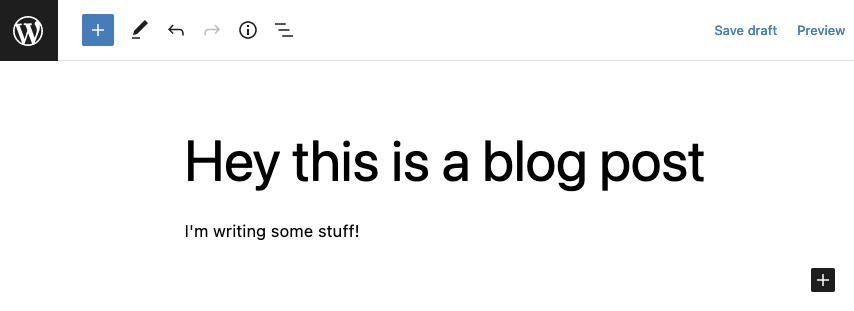

Click the plus button  and check out all the different elements you can add to your page. WordPress calls these **Blocks**.

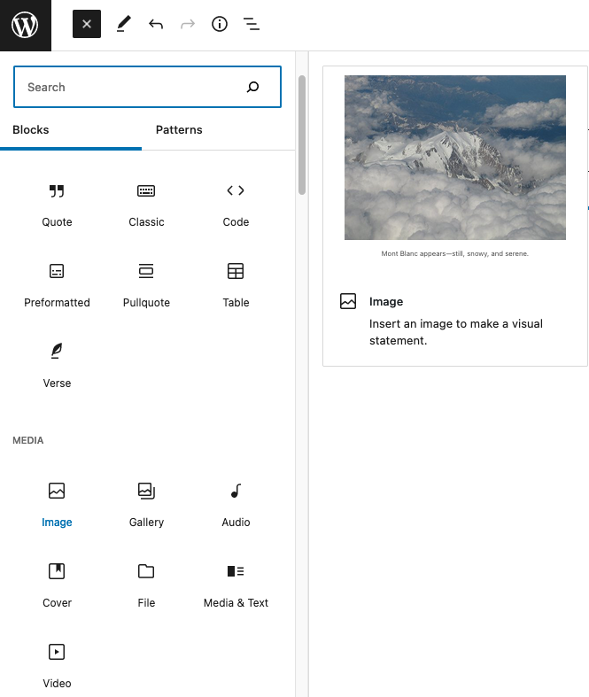

You can also check out the Patterns tab, which you can think of as groups of blocks, or templates. They can help you get started creating more complex page layouts if you need them.

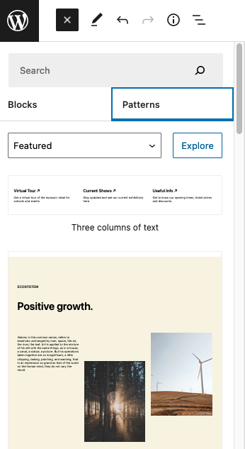

On the top right of your screen, click the settings button , then **Post**.

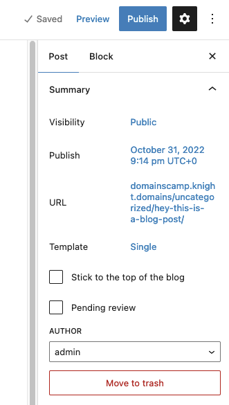

This menu will let you modify your post's metadata. From here, you can do things like:
- Change who can see your post
- Schedule when your post gets published
- Set Categories or Tags to organize your post
- Modifying the URL the post will be published at
- Set a featured image

There's a lot you can do with the WordPress Block Editor, so if you are looking for more detail on what's possible, check out this page: 

[WordPress Block Editor - wordpress.org](https://wordpress.org/support/article/wordpress-editor/)

It's time to publish our first post! When you are ready, click the Publish button  at the top right of your screen. You'll have to confirm you are ready to publish your post by clicking the button a second time. 

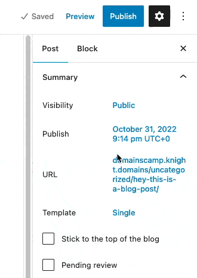

Now that your post has been published, let's go to the homepage of your site to see it. Click **View Post** and check it out!

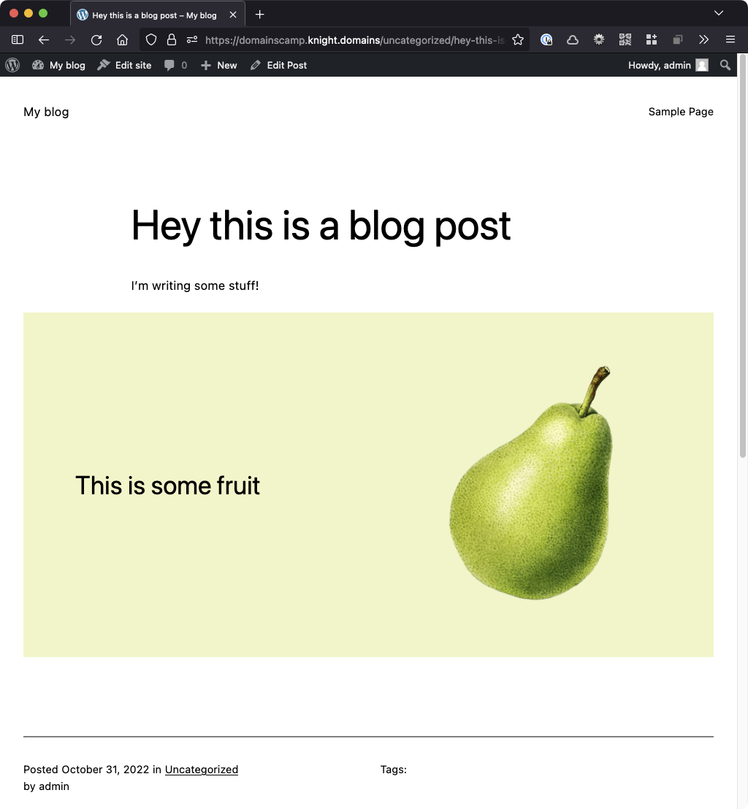

### Pages

Now that we've made our first Post, let's talk about pages for a second. Posts have metadata attached to them (data about the post, like publish date, and author) and are often displayed in a blog-like layout. Pages are simpler and do not typically display any metadata. Pages are most often used for content that doesn't make sense as a blog post.

From your Dashboard, click on **Pages** to see all the pages on your WordPress site.

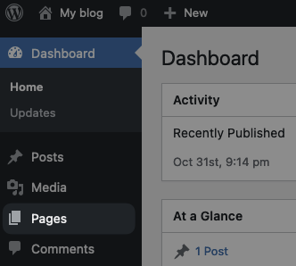

If you want to get rid of the sample pages that come with a new WordPress site, you can use the checkboxes and the Bulk actions menu to delete them.

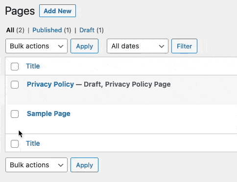

Use the **Add New**  button to make a new page. Give your page a title and put some text on the page, then publish it.

This time, instead of going directly to our new page, let's check out the homepage of our site to see how Pages and Posts show up differently in WordPress. You can get there by clicking the black button  at the top left to get back to the Dashboard, then by clicking on the Home button  from the Dashboard. You can also simply type in your site's URL into your browser's address bar!
 
From your homepage, you should see your blog post and the page you just made.

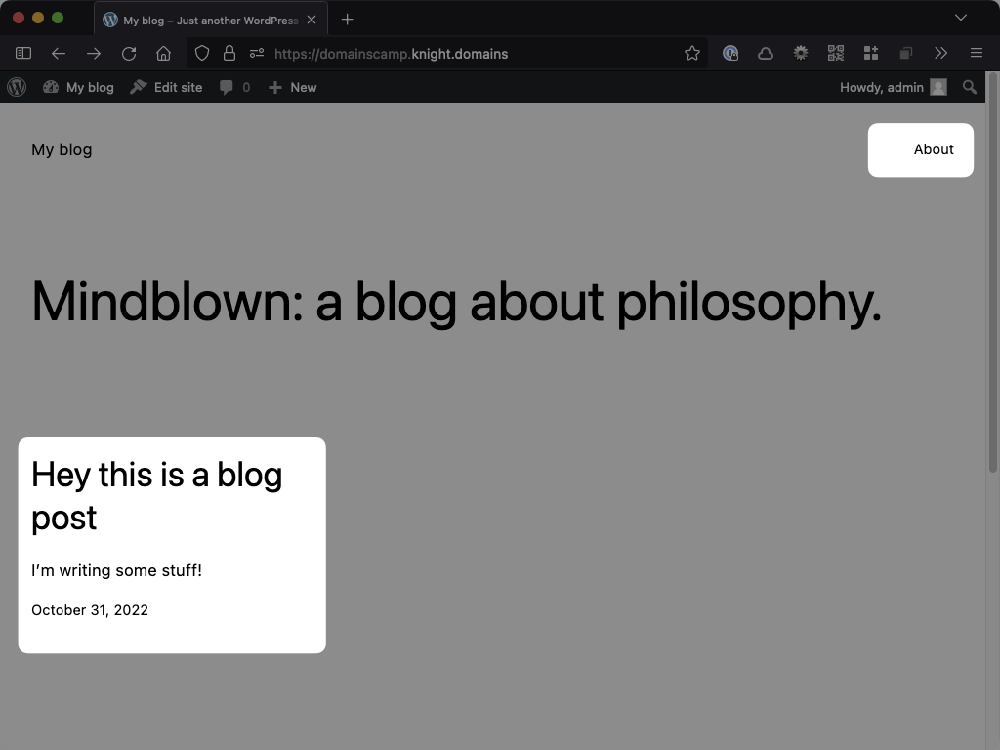

### Settings

Now that you've published a post and a page, you know how to add content to your site! Next, we'll move on to the Settings area of the Dashboard. WordPress has quite a few settings that allow you to change how your site works, but there are a few that are good to know about right away.

Get started by logging in to your site's Dashboard, then go to **Settings**, then **General**

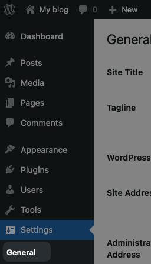

The **Site Title** and **Tagline**, both of which typically show up in your site's header, can be changed from here.

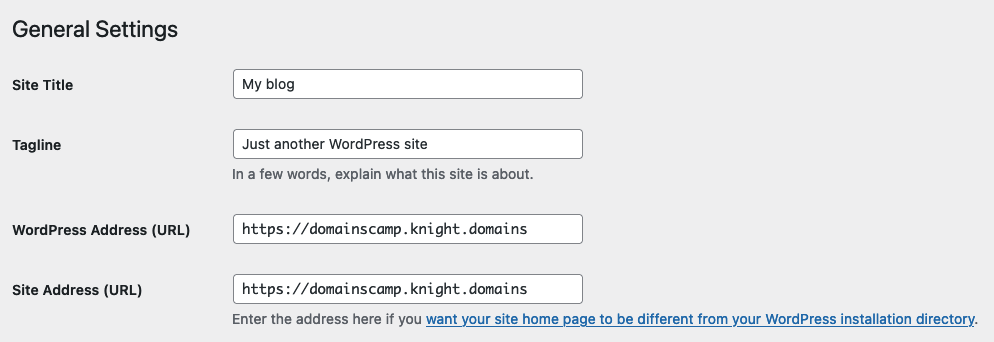

#### ⚠️ Don't change the URLs on this page!
Do not change the **WordPress Address (URL)** or **Site Address (URL)** fields from this page. Those fields tell WordPress what the URL of your site is supposed to be, and if they are changed, your site likely will not work (don't worry this can be fixed!). If you do want to move your site to a different URL that can be done from cPanel later, using Installatron.

Next, lets head over to **Settings**, then **Reading**.

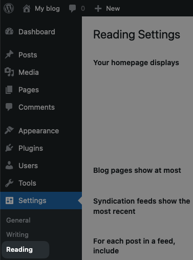

Right at the top of this page is the **Your homepage displays** setting. By default, WordPress will show the latest blog posts on your site on the homepage, but you can change that.

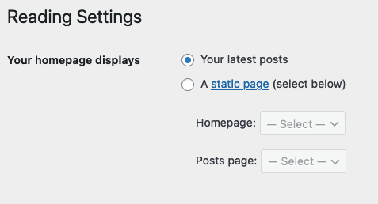

For instance, you could set the page we made earlier as your Homepage, then make a blank page called **Blog** and set that as the Posts page.

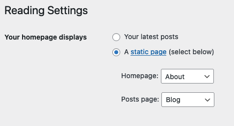

If you do set things up that way, you'll see the Front page and Posts page indicated when you visit **Pages** in the Dashboard.

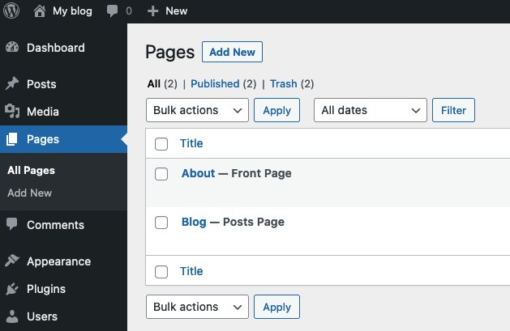

In this example, the About page becomes the homepage of the site:

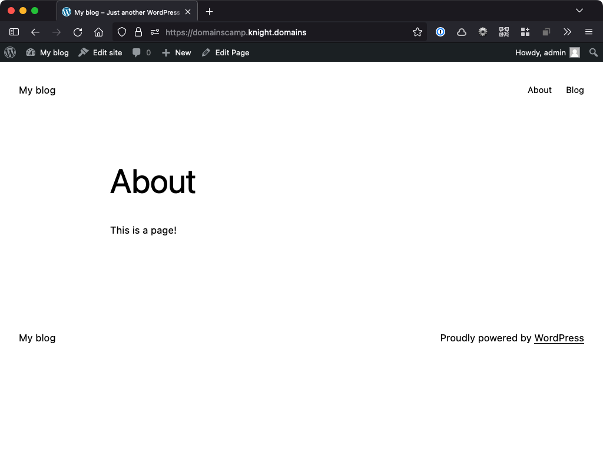

### Appearance & Themes

So far, we've published content to our site, and looked at some of the settings that we can change to make the site fit our needs better, but if you want to change the way your site looks, you'll want to either use the Site Editor, or change your site's theme. We'll briefly jump into both of these options.

##### Site Editor
 
The way your WordPress site looks is affected by the theme you are using, and how you have that theme set up. Some themes support the Site Editor, which is a powerful tool that lets you change almost every aspect of the way your site looks.

You can get to the Site Editor by going to your Dashboard, and clicking on **Appearance**, then **Editor**.

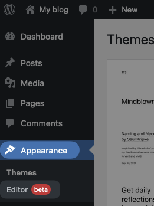

From here, you can edit many things about how your site looks, including its layout and structure. 

We'll start by clicking on **Styles**  at the top right.

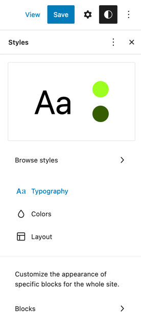

The Styles panel will let you change many different aspects of the way your site looks, but a good way to get started is to click **Browse styles** and check out some of the presets available.

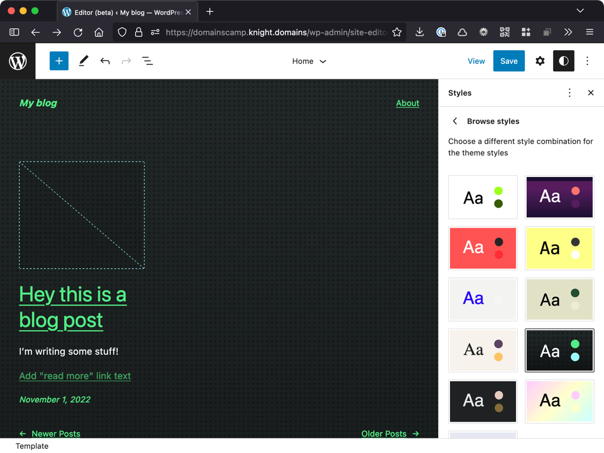

##### 💡 If you are looking more info on using Styles, check out this video:

[Styling Your Site With Global Styles](https://learn.wordpress.org/tutorial/how-to-style-your-site-with-global-styles/)

You can also individually modify components of your site. For instance, you can remove the default header on the site, by clicking on it, clicking the three dots at the end of the menu, then **Remove Heading**.

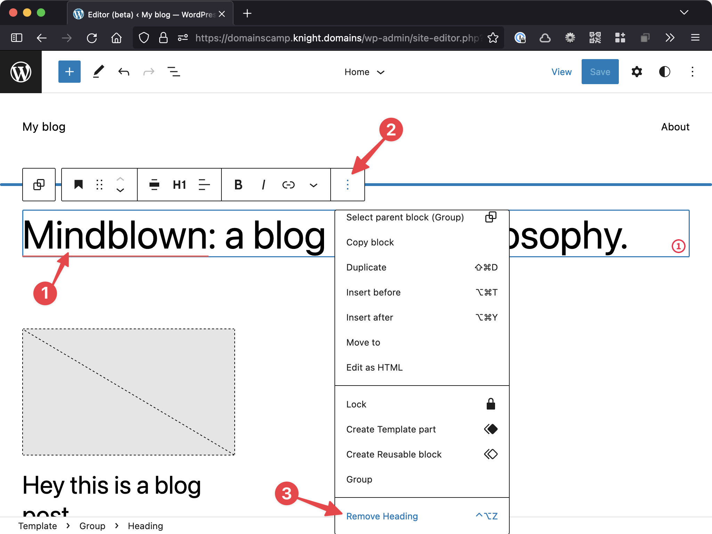

You can also click the **List view** button  in the toolbar to open a sidebar that lets you see all the individual components that make up your site. 

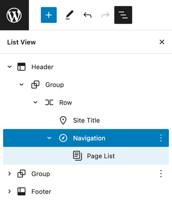

#### Themes

If the styles and various options available in the Site Editor aren't working for you, you might want to try switching to an entirely different WordPress theme.

Go to **Appearance**, then **Themes** to get started.

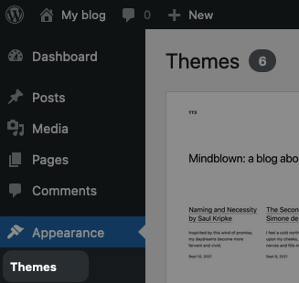

This page will show all of the themes currently installed on your website, as well as the theme your site is currently using, which will be labeled as **Active**. To find and install more themes, click **Add New**.

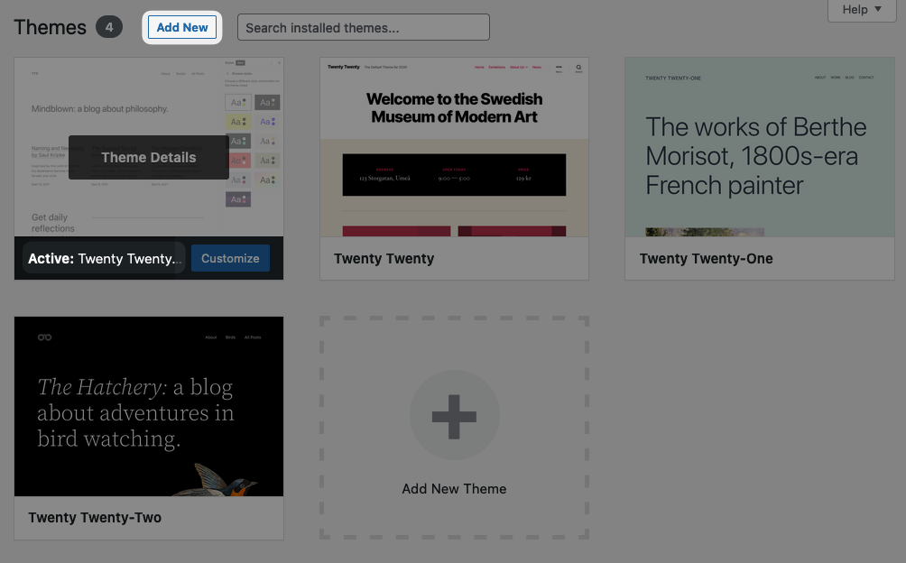

From here, you can browse themes to try out. Themes come in all shapes and sizes, and some of them have additional features and functionality designed for a specific use-case, like building an online store. 

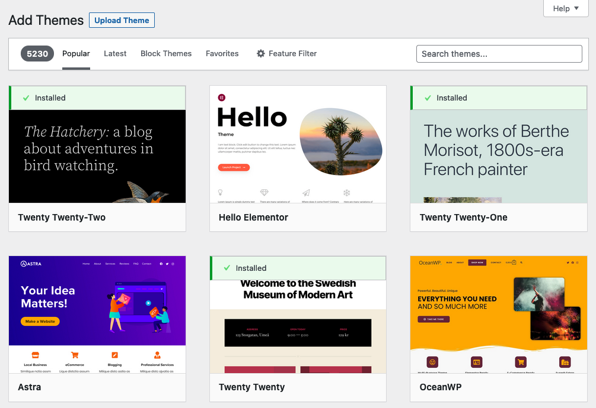

If you are looking for a narrower selection of themes to get started with (sometimes too many options can be overwhelming!), we'd suggest checking out some of the themes from these theme authors:

- [Automattic](https://wordpress.org/themes/author/automattic/)
- [Anders Norén](https://wordpress.org/themes/author/anlino/)
- [GoDaddy](https://wordpress.org/themes/author/godaddy/)

When you find that looks good to you, you can click **Install**, then **Live Preview** to see what that theme would like on your site. 

##### Customizer

This will bring you to **Customizer** where you can preview the theme on your site, as well as tweak the theme's options using the menu on the left. If you are happy with this theme, click **Activate & Publish**. When you are ready to exit the Customizer, either because you are ready to check out another theme or you activated a theme you want to stick with, click the  button at the top left.

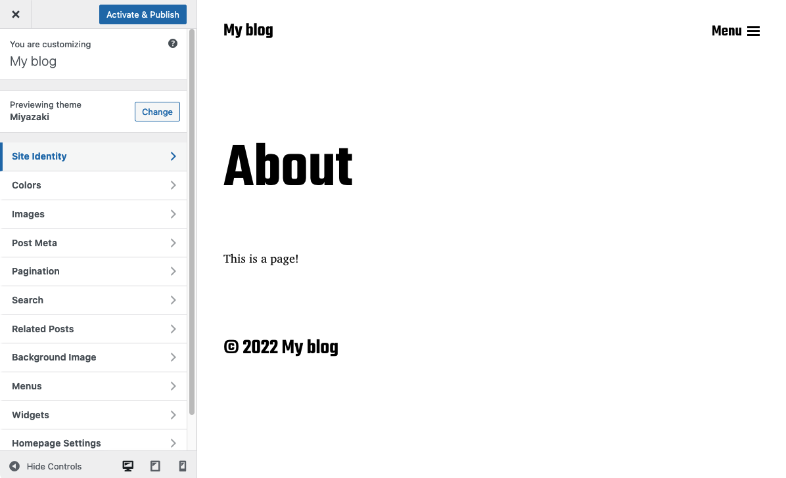

If you ever want to get back in to the customizer to change settings related to your site's theme, you can go to **Appearance**, then **Customize**.

Note that some themes will give you the option to use the Site Editor, and other themes use the Customizer instead. Which type of theme you prefer to use is a personal preference, some people like the flexibility of the Site Editor, and others like the simplicity of the Customizer.

### Plugins

Plugins are an amazing part of the WordPress ecosystem, and can add all kinds of functionality to your WordPress site. From your Dashboard, click **Plugins** to check them out. 

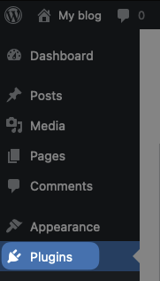

From here you will likely find a few plugins already installed and activated. Activated plugins are highlighted in blue. Just like themes, you can have a plugin installed, but not activated, which means it is not currently doing anything. You can read a plugin's description to find what it does, as well as use the **Deactivate** button to deactivate any plugins you don't need to use. It's a good idea to only keep plugins activated that you are actively using, as in some instances too many activated plugins can slow down your site, or in rarer cases cause compatibility errors that prevent your site from working properly. 

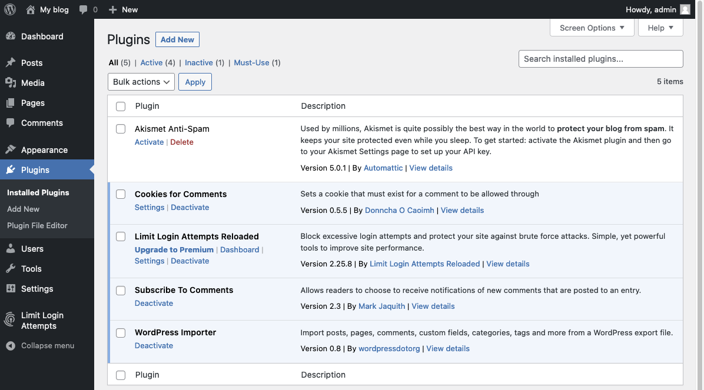

If you are looking to add a plugin to your site, you can use the **Add New** button to search for and install plugins, just like themes. 

A good example plugin we can try out is [Contact Form 7](https://wordpress.org/plugins/contact-form-7/), which is a popular free plugin that lets you set up a simple contact form on your site. Find it using the Search field, then click **Install** and finally **Activate**.

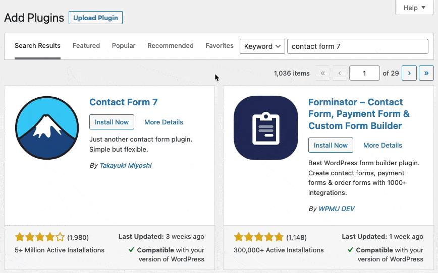

Then from the **Plugins** page, click **Settings** under Contact Form 7, to configure your form.

When you are all set to add the form to your site, go edit a page (or make a new one) and click the plus button  and search for **Contact Form 7** to add the form to the page. Click **Update** and go visit the page to check out your new contact form!

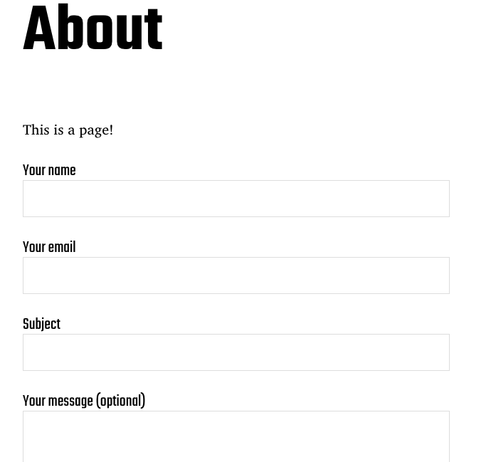
