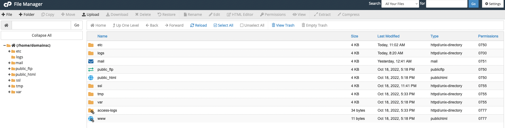

# Understanding Domains and File Structures

So we've decided where and how we're going to establish our digital identity; how does the web know where to send us and what to show us when we search for and load sites? The web is built on structure; everything has to be in just the right place, written in just the right way, and linked to just the right resources in order for a single page to load as it should. Remember, computers and the internet may seem "smart," but they're really only just very good at following instructions. The more you understand how the web communicates, the more agency you wield as an engaged digital citizen!

## Domains

Domains draw the boundaries of your little corner(s) of the web. While the basic definition of "domains" may be simple enough— a human-readable and -rememberable (ok, not a word, but you get what we mean) IP address— actually understanding how they work, their different facets, and the different ways you can use them can definitely leave your head spinning.

### Key Terminology 

Let's start by going through the basic terminology around domains:

- [Apex Domains](#apex-domains)
- [Subdomains](#subdomains)
- [Subdirectories](#subdirectories)

#### Apex Domains

Also known as the "root" domain, an **apex domain** is the actual base domain that you purchase/register, such as [reclaimhosting.com](https://reclaimhosting.com/). It's the "base" of your tree, to so speak, from which the rest of your web activity related to that name grows.

#### Subdomains

If you're looking to have more than one site in your hosting account, one way to do this would be via a **subdomain**. A subdomain is a branch off of your apex domain tree; it's a prefix added to your root domain. Ex: [community.reclaimhosting.com](https://community.reclaimhosting.com/).

While you can always purchase a new domain to build a new site on, there may be various reasons why you might want to implement a subdomain instead. First of all, you don't have to purchase a subdomain; it comes free with your root, and as many as you need. Second, you may want your new site to be associated with your apex domain in some way. While a subdomain site is a separate, distinct site from your root site, you may still want visitors to make that connection between the two. 

Remember, while subdomains are related to your apex domain, they don't have to run on the same platform, with the same software, or even on the same server! You get lots of flexibility to use these as you will.

#### Directories

An alternative to setting up subdomains, **directories** allow you to do much of the same things described above. Instead of adding a prefix to your apex domain, however, you would be adding a suffix. Ex. [reclaimhosting.com/blog](https://reclaimhosting.com/blog/).

Directories are exceedingly simple to add to your apex domain; you can create them on the fly when installing applications (like WordPress) or directly in your File Manager.

Something to keep in mind about directories, though, is that there is always the possibility that they could conflict with *pages* on your website. Think about it: say you wanted to install a new image gallery site at mydomain.com/gallery, but you forgot that you'd already made a page on your apex domain's WordPress site also named "Gallery," making its URL mydomain.com/gallery. If you go through with creating that directory, errors and conflicts will abound.

### Choosing a domain name

There are a few things to consider when choosing your domain name. Your Knight Domains account will provide you with a free subdomain of the [knight.domains](https://knight.domains/) apex domain, meaning that your domain will look something like *mydomain.knight.domains* rather than *mydomain.com*. If you'd like to purchase your own domain name, you can certainly do so and map it to your Knight Domains account as an [addon domain](https://support.reclaimhosting.com/hc/en-us/articles/1500007924482-Adding-a-New-Domain-to-cPanel) after signing up with your subdomain. However, if you'd rather use the free Knight Domains subdomain while it's available to you and switch over to a top-level domain after you graduate, that's also an option. Just keep in mind that if you snooze you lose when it comes to registering a domain; while janicejones.com might be available for registration now, that doesn't mean it will still be available in a year, or even a week.

Check out Autumn Caines helpful post on domains [What's in a Name](http://blog.knight.domains/gs/whats-in-a-name/index.html) to read more about these considerations.

### Installing a web application to your domain

Now that we understand a little bit more about what the different options and possibilities are for organizing your little corner of the web, let's talk a bit more specifically about actually setting up your site, whether that be to your apex domain, subdomain, or directory: they'll all follow a similar workflow.

Knight Domains makes it very simple to install certain web applications in your cPanel account. Web applications are just special software that run on a web server. Usually, they allow you to build and manage a website. The kind of site you can build depends on the type of application you install. Here are some examples of applications that you can easily install within the Knight Domains web hosting interface:

 **WordPress**: WordPress is a simple-to-use blogging application. The tool also comes with a _huge_ array of plugins & themes to allow you to create virtually any kind of website imaginable.

 **Omeka:** Omeka is an open-source web application that can be used to create and display online digital collections and archives.

 **Scalar:** Scalar is a content management system with the idea of creating non-linear books on the web.

 **Grav:** Grav is an open source, flat-file CMS made for folks who are looking for something a little more experimental. Grav provides a straightforward framework for creating pages and inserting media.

 **Mediawiki:** It is the open-source wiki software that runs the online encyclopedia, [Wikipedia](https://www.wikipedia.org/). This tool may be right for you if you’re interested in publishing documents and then collaborating with others on them.

These are just a _few_ of the open-source applications that are available to you in your hosting space.  We encourage you to read more about what web applications are and which ones are available to you through Knight Domains.

### 🎯 Activity: Setting up your Knight Domains account

Now that we've learned about some of the things you should be thinking about when choosing a domain name, let's get signed up!

1. Go to [Knight Domains](https://knight.domains/) and click the **Sign Up** button to sign in with your SNC credentials.

2. Pick your **subdomain** (remember, if you'd rather have your own apex domain we can always add that later) and click **Continue**.

3. Review your chosen subdomain and contact info on the following page and, if correct, click **Sign Up**. 

You should be all set!

## File structures

So we have a solid grasp on what domains are and the different ways that we can use them, as well as what's available to us when we go to install a web application to those domains. This has involved a lot of "interface" work; clicking buttons and making things happen. The most fun part of having your very own web hosting environment is being able to look past the interface and explore what really runs the web!

Web hosting is, at its basic core, files and folders on a computer that is connected to the internet and setup to distribute them.

### The File Manager

When you sign up for your domain, a web hosting account is created. Although you typically will interact mostly with the web interface to create subdomains, install applications, and other common tasks, you might occasionally also need to work directly with the files in your account. The **File Manager** in your cPanel is one way to see these files. You can also create an FTP account in cPanel and use an FTP program to interact with these files (FTP stands for File Transfer Protocol, and it’s a way of using a desktop client to transfer files to and from your Web server space).

You can find your File Manager by searching for it in your cPanel's dashboard:

### public_html

From here, you'll be able to see a variety of folders at the root of your web space. Take note of the **public_html** folder in particular. Your main domain will correspond with this folder. Whatever files and folders are inside of this folder are available on that main domain. If you installed WordPress here, you’ll likely see a lot of WordPress-related files within it (which were probably helpfully put there by the automated installer). Let’s say we uploaded an image called mypicture.jpg directly into the public_html folder. That image would now be available at yourdomain.com/mypicture.jpg. The slash after your domain implies “this file is inside this folder”. But what if we had a folder inside the public_html folder? How does that appear? This is typically called a subfolder so let’s put a folder in public_html called “images” and put our image, mypicture.jpg, inside of that folder. What would you type in a browser to get to that file now? The location would be mydomain.com/images/mypicture.jpg. So subfolders are also indicated by a forward slash after a domain.

Now you may be asking, **"What about subdomains? Where are *they* in the file structure?"** Folders for subdomains are located inside the public_html folder. So when you go to the File Manager and navigate to public_html, you’ll see folders listed for all of your subdomains and once you navigate inside one of those folders, you’ll see files and folders specifically for that subdomain that appear on the web at that subdomain’s address. 

### index.html

As web design gets more and more complicated, it can be easy to lose track of the most essential aspects of any website; aspects that the web hasn't stopped looking for when trying to serve your site. One file in particular is like the final supporting peg in Jenga, without which the whole structure will topple, and that file is called **index.html**. 

The index.html file is what serves a site's homepage, and is a standard title that almost all web servers are configured to recognize. All of your directories should have an index.html file, even if they don't contain anything, in order for them to be properly recognized by the web.

### 🎯 Activity: Digging into the File Manager

Now that we've learned a bit about how your web browser looks for when you type in a URL, let's see how that works in real-time with this quick activity. Navigate to your File Manager to get started.

1. Make an `index.html` file in `public_html`, type a phrase (like "Hello World!") and save it. Open a new tab and type in your domain. What do you see?

2. Return to `public_html` and create a folder. This is a directory of your apex domain. Open a new tab and type in your domain with the name of your new folder (directory) appended. E.g. mydomain.com/newfolder. What do you see?

3. Now return to your new folder in the File Manager and create and save an `index.html` file with some text in it. Refresh the tab with the most recent URL. Better?

4. Try making a subdomain (you can read about how to do that in the guide [Creating and Managing Subdomains](https://support.reclaimhosting.com/hc/en-us/articles/1500013046121-Creating-and-Managing-Subdomains)) and going through this same process from within the File Manager until you see some text loading.

5. When you are all finished experimenting with URLs and subdomains, return to the `public_html` folder and delete the `index.html` file and the folder you created. We'll need those gone so we can build a site here later!

### 💡 Want to learn more?

If you're interested in learning more about the basics of website building, we recommend you explore the three basic pillars: HTML, CSS, and JavaScript. 

A great free resource for learning about all three of these (and more) is [W3Schools](https://www.w3schools.com/). For more project-based JavaScript practice, check out https://javascript30.com/.

---
**Attributions**

Information on subdomains and directories is based on Reclaim Hosting's support article [Subdomains and Subfolders](https://support.reclaimhosting.com/hc/en-us/articles/4404727287575-Subdomains-and-Subfolders#subdomains-and-subfolders-0-0).
Information on installing web applications and file structures are based on Reclaim Hosting's [DoOO Community Docs](https://stateu.org/docs/#what-can-you-do-with-your-account).
