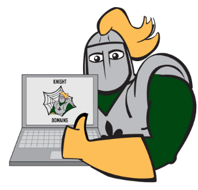

# Domains Camp

Domains Camp is designed for students, faculty, and staff at SNC who want to learn how to build their digital presence on the web. These modules help you understand how the web works and how to get started building your digital identity.

## Modules
1. [What is the web?](what-is-the-web.md)
2. [Digital Identity and Ownership](identity-and-ownership.md)
3. [Understanding Domains and File Structures](domains-and-files.md)
4. [Goal Setting](goal-setting.md)
5. [Installing WordPress](installing-wordpress.md)
6. [Building a Site with WordPress](building-wordpress-sites.md)
7. [Teaching and Learning with Domains](teaching-and-learning.md)
