# Installing WordPress

Now that you've got a domain name and a goal in mind for your site, we can get started building! We'll start off by getting WordPress installed.

## Getting started

Log in at [knight.domains](https://knight.domains) to get to your Dashboard. Under the **Applications** section, select **WordPress**.

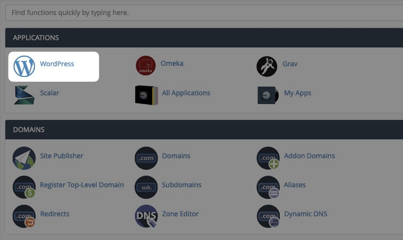

Next, click **Install this application** in the upper-right corner.

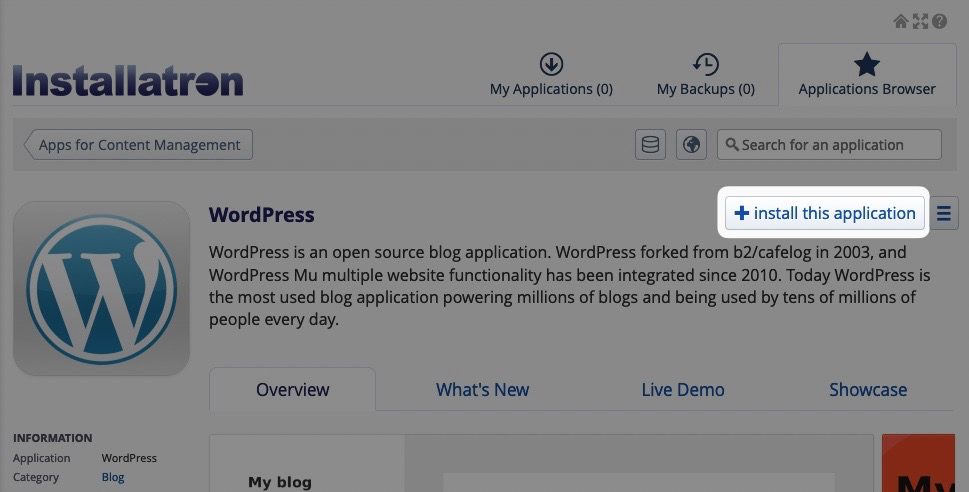

## The Install page

The Install page is divided up into several sections, the first section, **Location**, let's us define the URL our site will live on.

### Location

Click the **Domain** dropdown to pick a root domain or subdomain your site will be installed to. In addition to this, the dropdown will show you URLs that start with either **http://** or **https://** and URLs that start with or without the **www** subdomain. Selecting a URL that starts with **https://** will force your site to load securely, and selecting a URL that starts with **www** will force visitors to your site to type **www** in their address bar.

In most cases, we want our sites to load over **https://** but we don't want the **www** subdomain to be required, so for this example we'll select **https://domainscamp.knight.domains**.

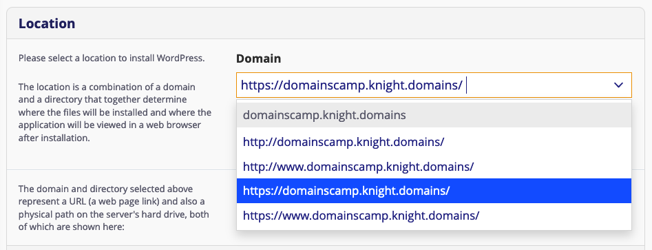

In addition to the **Domain** dropdown, you will want to pay attention to the **Directory** field as this will also affect the URL your site is installed to. Depending on whether you already have other applications installed to your account, this field may be pre-populated with text. You can change or delete the text in that field to change the URL for your site. For this example, we do not want the blog directory in our site's URL, so we deleted it:

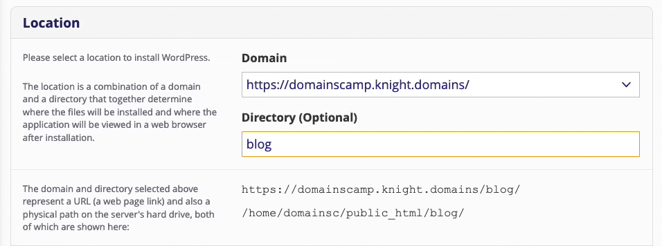

### Version

The **Version** section lets us specify what version of WordPress we want to use, whether or not we want to use a content template, and how Automatic Updates are managed. We can leave all of the settings in this section at their default values and continue.

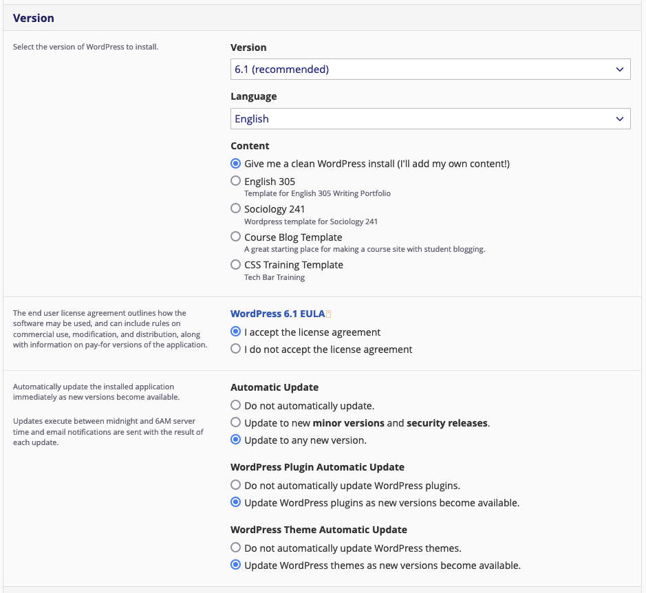

### Settings

In the **Settings** section we will want to set a Username and Password for our WordPress site; make sure it is [a strong password](https://www.security.org/how-secure-is-my-password/) that's not easy to guess!

If you want to, you can change the **Website Title** and **Website Tagline** of your site from this section, but you can always update these later in WordPress after you get it set up. We'll leave the **Limit Login Attempts** and **Enable Multi-site** fields alone. 

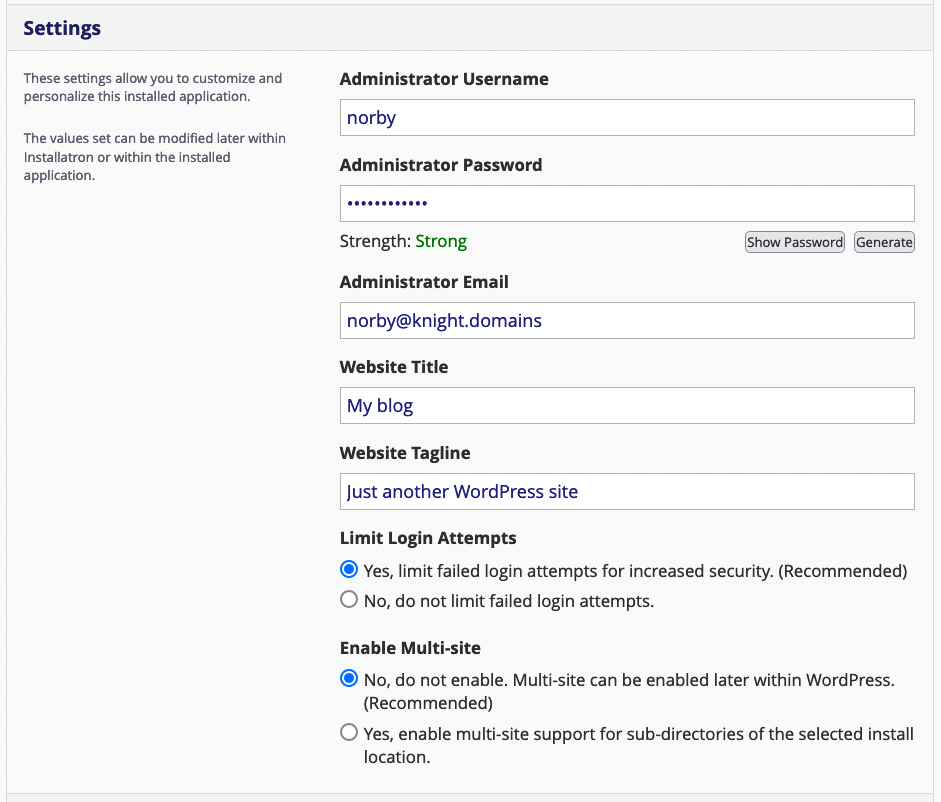

### Install!

We can leave the **Advanced** section alone, which means we all that is left to do is click **Install** to get our site set up!

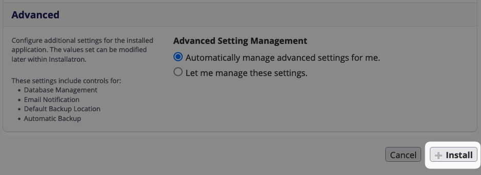

## My Applications

After the install has completed, you will be brought to the **My Applications** page, which serves as an overview of all the applications installed on your account. You can always return to this page by logging in to [knight.domains](https://knight.domains) and clicking on **My Apps**.

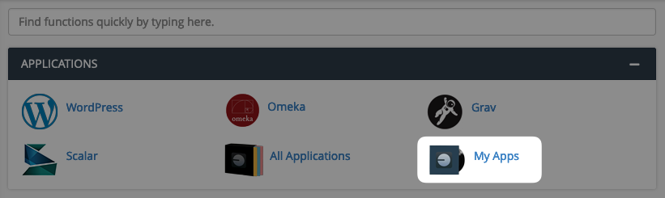

### Logging in to WordPress

From here, you should see an entry for the WordPress site you just installed.

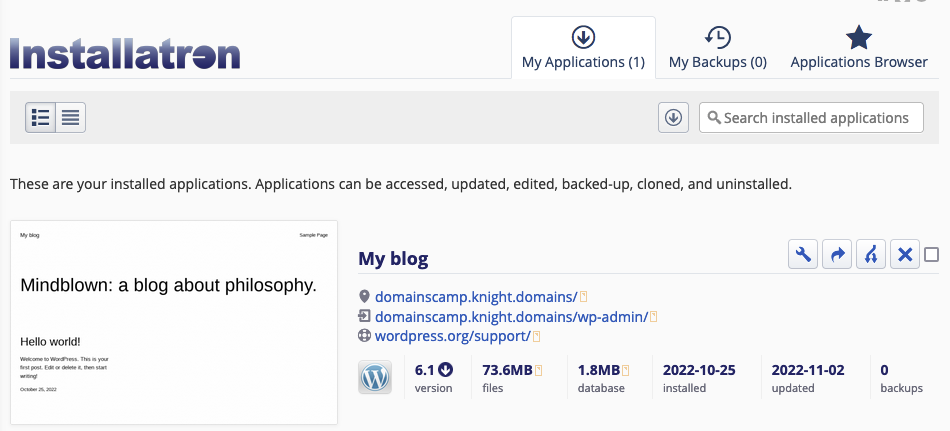

Underneath the title of your site, there are two links you will want to make note of. The first is the public URL of your site. Click on this link so we can see what our brand new site looks like!

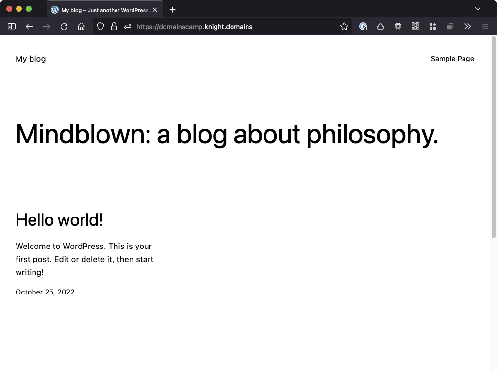

Next, return to the My Apps section of cPanel and check out the link that ends in **/wp-admin**. This is the URL for your site's WordPress dashboard. In this case, it's [domainscamp.knight.domains/wp-admin](https://domainscamp.knight.domains/wp-admin).

If you open up a new tab and visit this URL, you can enter the username and password you set up in the Settings section of the install page. 

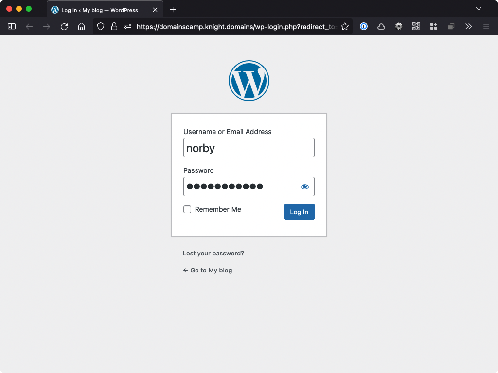

#### ❗️ Time-saving Tip
If you click on **/wp-admin** link directly from the **My Applications** page, Knight Domains will log you in automatically, without requiring you to enter your username and password!
