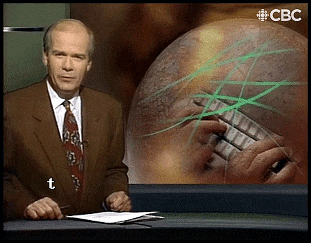
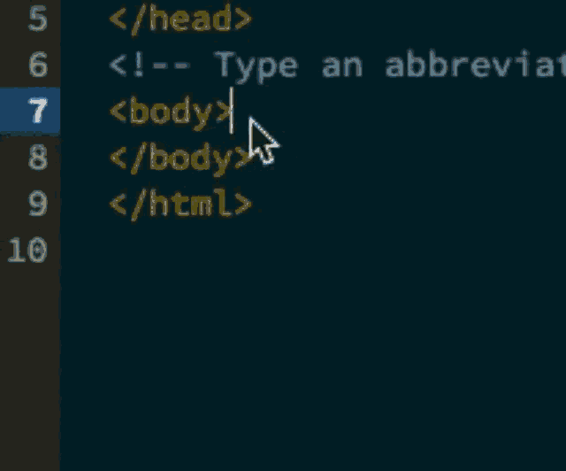

# What is the Web?

## The Web versus the Internet
The terms web and internet are often used interchangeably, but it's worth noting that the web is just one, albeit galactically successful, outgrowth of the myriad possibilities of the internet. 

The **internet** refers to the broad infrastructure of distributed, decentralized networked computers that provide the ability to rapidly transfer data between access points. 

*the growing phenomenon of INTERNET*

Whereas the **web** is a series of protocols developed for the internet that allow for the creation, publication, and linking of information on and between pages and sites. These early pages were often referred to as hypertexts, a reference to the [Hypertext Transfer Protocol](https://en.wikipedia.org/wiki/Hypertext_Transfer_Protocol) (HTTP) that made the connection between a web client (a.k.a. browser) and a server possible. What shows up on that web client is written in a specific mark-up language called [Hypertext Markup Language](https://en.wikipedia.org/wiki/HTML) (HTML) that makes both the linking and embedding of resources possible.

 
*HTML in action!*

Whereas the internet can be understood as the infrastructure that connects computers, the web is an internet protocol that connects people.

## History
Katie Hafner's *Where the Wizards Stay Up Late* was written in 1995--- just as the web was becoming a household phenomenon---and documents the birth and development of the internet from the late 60s through the 1980s.

Beyond the Herculean engineering feat of integrating a vast network of computers to communicate data almost instantly (something Hafner's book narrates brilliantly), there needed to be an application to both harness and demonstrate the power of this network. And that first killer app for the internet was electronic mail or E-mail, and it's still around!

*AOL's iconic "You've Got Mail" was a gateway to the internet for millions of early, non-geek users*

Email provides a good example of the difference between the internet and the web. Email was invented in 1971, that's almost 20 years before Tim Berners-Lee invented the web! Email was using the protocol FTP to transfer messages, and the @ was used as a convention to filter and point messages to specific users. Other email protocols such as Simple Mail Transfer Protocol (SMTP) were developed in the early 1980s, demonstrating the internet was constantly developing and evolving since its inception in 1969 and would in many ways break-through to a mass audience 25 years later thanks to the relative usability and flexibility of the web protocols.

*[A long-short history of the development of web protocols as demonstrated through a handshake](images)*

Much of the pre-web internet was not only dominated by e-mail (some things never change), but also [bulletin board systems](https://en.wikipedia.org/wiki/Bulletin_board_system) (BBS). The explosion of personal computing in the 1980s allowed more and more people to access the internet through their home phone lines, this resulted in more distributed access to email and BBS, although the interfaces were almost exclusively text-based and relatively arcane, this was only exacerbated by seemingly impossible bandwidth limits by today's standards, ranging anywhere from 1200 to 2400 bits per second during the 80s versus now when fiber connections have transfer rates as fast as 1GB /per second, or 8,000,000,000 bits.

BBS gave rise to games, chat rooms, etc. and may be seen as an early predecessor of our current, predominately corporate controlled ecosystem of social media.

## What do you need to make a website?
You need a few things to make a website:

A computer with access to the internet would be the first two requirements.

After that, you would need a basic text editor to write your HTML code. This is often baked into web applications now, but HTML can be written in just about text editor as long as you follow the [hypertext mark-up language's protocol](https://www.w3schools.com/html/).

After you have written your HTML code, you would need to upload these files to a publicly available directory on a web server. The most common web server is powered by the Linux operating system using Apache, both open-source technologies that power 90% of the web. Uploading these files to a server would require a tool for transferring files using the File Transfer Protocol (FTP).

Once the files are uploaded to a publicly accessible directory on a server, the pages can be accessed via web browser at the URL, or web address of the uploaded pages. The web address, or domain, can be something you register and manage through a domain registrar, or part of another site such as the 1990s killer web application [Geocities](https://en.wikipedia.org/wiki/Yahoo!_GeoCities) (which also included a web-based FTP app to make that step easier for users).

## Fun facts Quiz:
When and where was wireless first used for internet connections?
In 1971 engineers first started using [wireless connections to try and connect the Hawaiian islands](https://en.wikipedia.org/wiki/ALOHAnet).
